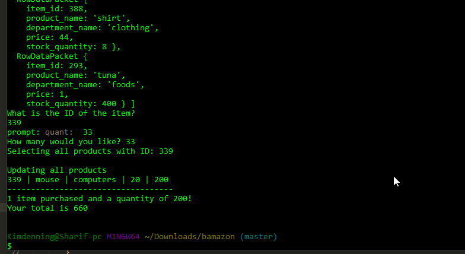

# Bamazon
Item database with search function

This node based app enters product information into a MySQL database.

It allows a user to purchase items by specifying the item's ID and quantity to be purchased.  

The amount of an item aquired by the user will be deducted from the database total. 

The program will request an amount less than the amount in the database if the user goes over 
the total.  

The program will list the total price, quantity of the item purchased.

It will display the remaining items in the database after a purchase.  

 
